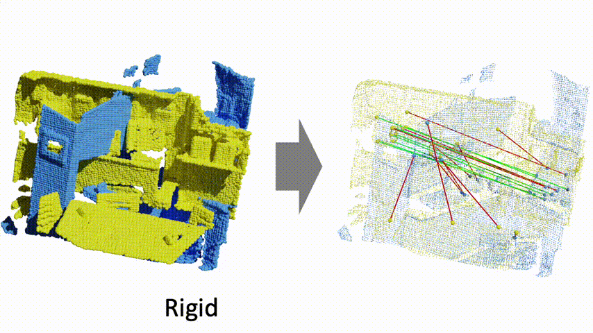
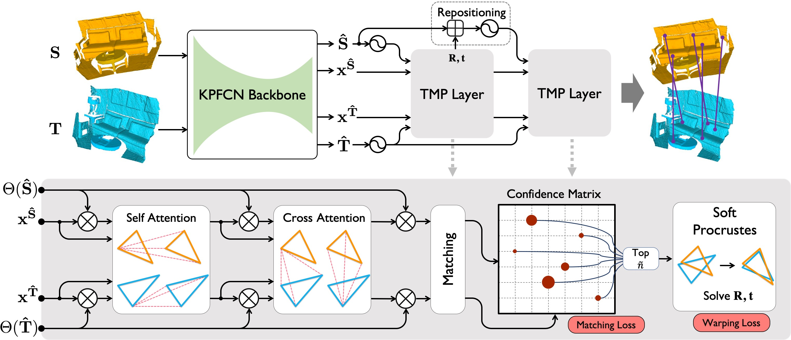
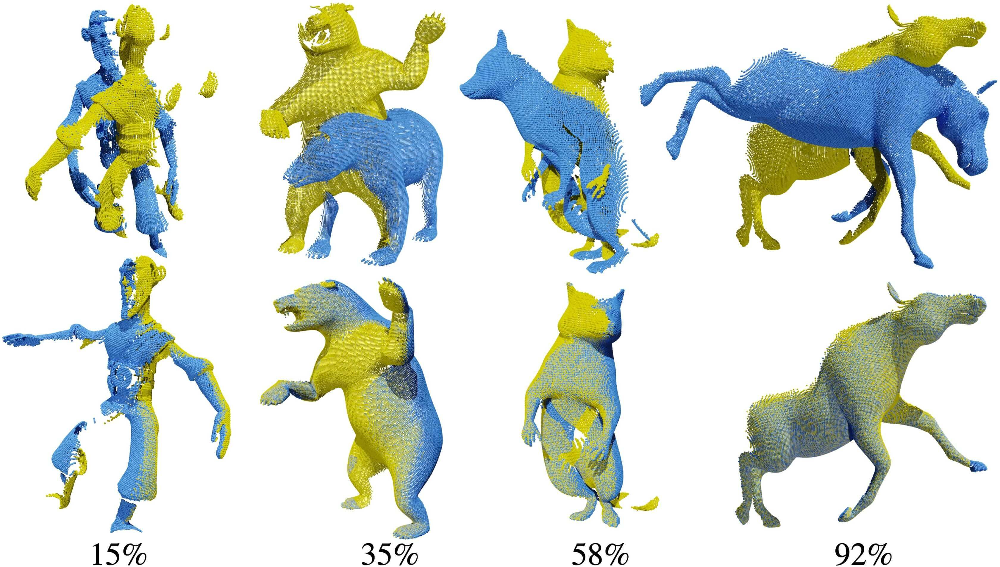

## Lepard: Learning Partial point cloud matching in Rigid and Deformable scenes





### Method overview



### 4DMatch Benchmark
4DMatch is a benchmark for matching and registration of partial point clouds with time-varying geometry.
It is constructed using randomly selected 1761 sequences from [DeformingThings4D](https://github.com/rabbityl/DeformingThings4D).
Below shows point cloud pairs with different overlap ratios.




### Installation
We tested the code on python 3.8.10; Pytroch version '1.7.1' or '1.9.0+cu111'; GPU model GeForce RTX-2080 or Nvidia A100.
```shell
conda env create -f environment.yml
conda activate lepard
cd cpp_wrappers; sh compile_wrappers.sh; cd ..
```


### Download data and pretrained model
- 4DMatch/4DLoMatch benchmark: [train/val/test split (15.6GB)](https://drive.google.com/file/d/1YoHWhVaH5Yyo1gTjybiuaODA1lZrM_nG/view?usp=sharing).

- 3DMatch/3DLoMatch benchmark (from the [Predator](https://github.com/overlappredator/OverlapPredator) paper):
 [train/val/test split (4.8GB)](https://share.phys.ethz.ch/~gsg/pairwise_reg/3dmatch.zip).

- Pretrained model: [4DMatch & 3DMatch (500M)](https://drive.google.com/file/d/17QGX_wwtDPXN1GSKJHY-6RTIRPz90RLn/view?usp=sharing).


### Train and evaluation on 4DMatch
Download and extract the 4DMatch split to your custom folder. Then update the ```data_root``` in [configs/train/4dmatch.yaml](configs/train/4dmatch.yaml) and [configs/test/4dmatch.yaml](configs/test/4dmatch.yaml)


- Evaluate pre-trained
```shell
python main.py configs/test/4dmatch.yaml
```
(To switch between 4DMatch and 4DLoMatch benchmark, modify the ```split``` configuration in  [configs/test/4dmatch.yaml](configs/test/4dmatch.yaml))


- Train from scratch
```shell
python main.py configs/train/4dmatch.yaml
```


### Train and evaluation on 3DMatch
Download and extract the 3DMatch split to your custom folder. Then update the ```data_root``` in [configs/train/3dmatch.yaml](configs/train/3dmatch.yaml) and [configs/test/3dmatch.yaml](configs/test/3dmatch.yaml)

- Evaluate pre-trained
```shell
python main.py configs/test/3dmatch.yaml
```
(To switch between 3DMatch and 3DLoMatch benchmark, modify the ```split``` configuration in  [configs/test/3dmatch.yaml](configs/test/3dmatch.yaml))


- Train from scratch
```shell
python main.py configs/train/3dmatch.yaml
```


### Citation
If you use Lepard code or 4DMatch data please cite:
```text
@article{lepard2021, 
    title={Lepard: Learning partial point cloud matching in rigid and deformable scenes.}, 
    author={Yang Li and Tatsuya Harada},
    journal={arXiv preprint},
    year={2021}
}
```
